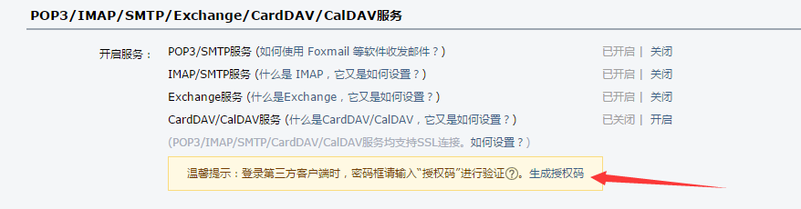

# 站长如何利用七牛云备份服务器文件？

关键词：七牛云备份服务器文件, zipfile模块, 服务器备份脚本, Python 自动化脚本, smtplib发送邮件, zip压缩文件或目录, Python教程

> 这是我们收到的第一份投稿，感谢作者对编程派的认可和信任。
> 本文讲述的是如何通过 Python 脚本自动化备份服务器文件,对于个人站长来说非常有参考价值。本文经作者授权进行部分编辑修改。作者的邮箱是：Millyn.network###gmail.com。如果有针对本文的疑问，可以留言或邮件咨询作者。

对于个人站长来说，最大的梦魇莫过于服务器突然崩溃导致网站数据丢失，那样自己辛苦的心血相当于付诸东流，可能怎么也找不回来了。因此，定期对服务器数据进行备份是一个标准实践。可是每次登陆服务器手动进行操作显然不是一个高效的方法，我们需要的是一键备份。

因此，我们决定利用编程语言 Python 写一个自动化备份服务器文件的脚本。具体来说，我们要利用 Python 自动压缩需要备份的文件或目录，然后上传到云端存储（这里我们选择了七牛云），然后在往自己的邮箱发送备份文件的下载链接。

相应地，我们会用到以下模块：

1. zipfile：压缩文件或目录 
2. qiniu：上传文件至七牛并返回下载链接
3. smtplib：用于发送邮件

接下来，我们就一步一步来实现这些功能。

## 第一步：文件压缩

ZIP压缩应该是最简单的步骤了，我们首先来看一段程序代码。

```python
import os , os.path , zipfile , time

def zip_dir(dirname, zipfilename):
    filelist = []
    if os.path.isfile(dirname):
        filelist.append(dirname)
    else:
        for root, dirs, files in os.walk(dirname):
            for name in files:
                filelist.append(os.path.join(root, name))
    zf = zipfile.ZipFile(zipfilename, "w", zipfile.zlib.DEFLATED)
    for tar in filelist:
        arcname = tar[len(dirname):]
        zf.write(tar, arcname)
    zf.close()

if __name__ == '__main__':
    zip_dir(r'/home/user/httpweb',r'/home/user/web_bak' + time.strftime('%Y-%m-%d') + '.zip')
```

我们不表代码究竟都是怎么写的，每一行都是什么意思，我们只讲述最终能够做到什么。

看代码内有一个方法```zip_dir```，这个方法需要有2个参数，分别是目标文件夹路径及压缩后文件存放路径及文件名。简单来说就是传递输入和输出目标。

那么在最下方```zip_dir(r'/home/user/httpweb',r'/home/user/web_bak' + time.strftime('%Y-%m-%d') + '.zip')```，我们传递了/home/user/httpweb这个目录作为需要打包的目录，而输出到/home/user/这个目录下并以```web_bak2016-04-20.zip```的文件名储存。

这里我们可以注意到```time.strftime('%Y-%m-%d')```是取当前时间日期并格式化输出年月日的对象。

当我们运行此Python程序后在/home/user/目录下就可以找到对应的zip文件了。

那么第一部分打包我们已经准备好了。接下来我们准备将文件上传至七牛云。

## 第二步：上传至七牛云

首先注册一个七牛帐号，在通过支付宝或身份证认证后应该可以获得

- 10GB 永久免费存储空间
- 每月 10GB 下载流量
- 每月 10万 次PUT请求
- 每月 100万 次GET请求
- 每月 750 小时自定义数据处理实例免费使用时间
- 每月MPS配额 20元

以上免费使用权，如果站不多肯定是够用，备份15天的数据应该就可以，后续我会加强写一个15天管理一次七牛储存并删除过期备份的Python脚本。

我们需要添加一个对象资源空间，添加时需要注意的是，访问限制是否公开或者是私密，这里我选择的是私密访问。

接下来在你要运行脚本的环境里安装qiniuSDK，在终端下输入```pip install qiniu ```来安装qiniuSDK。

再来看一段代码：

```python
from qiniu import Auth
import qiniu

access_key = 'your_accesskey'
secret_key = 'your_secretkey'
q = Auth(access_key, secret_key)
bucket = 'webbak'
file_path = '/home/user/web_bak' + time.strftime('%Y-%m-%d') + '.zip'
token = q.upload_token(bucket)
ret, info = qiniu.put_file(token, 'web_' + time.strftime('%Y-%m-%d') + '.zip', file_path)
```

在七牛控制面板里密钥管理界面可以查到自己的ACCESS_KEY和SECRET_KEY，或者在登入帐号后直接访问[密钥管理](https://portal.qiniu.com/user/key)。```bucket```需要设置为之前我提到创建对象资源空间的空间名。在这段代码中，除了上传到七牛储存功能外是没有其他任何功能的逻辑的，所以基本上有基础的Pythoner都能看的懂这段代码的意思。我就不多做解释，关于七牛PythonSDK的文档[在这里可以查阅](http://developer.qiniu.com/code/v7/sdk/python.html)。

## 第三步：邮件发送下载链接

最后我们来研究一下如何发邮件告诉自己备份成功了，并在邮件内容里附上下载链接。(根据七牛的文档,私密空间下载连接并不是永久的。)

我使用的是QQ的邮箱，要切记的是QQ邮箱在第三方登入时需要去申请**授权码**，而不是使用QQ密码或邮箱独立密码来授权。



好的，我们依然是看一段代码。

```python
import smtplib
from email.mime.text import MIMEText
import time

def sm(receiver, title, body):
	mail_host = "smtp.qq.com"  # 设置服务器
	mail_port = 465 # 端口
	mail_user = "xx@qq.com"  # 用户名
	mail_pass = "xx"  # 口令
	sender = 'xx@qq.com' # 发件人
	msg = MIMEText(body, 'html')
	msg['subject'] = title
	msg['from'] = sender
	s = smtplib.SMTP_SSL(mail_host, mail_port)
	s.login(mail_user, mail_pass)
	s.sendmail(msg['from'], receiver, msg.as_string())

sm('收件邮箱','标题','内容')
```

我依旧是写了个方法，该方法有3个参数。```sm('收件邮箱','标题','内容')```调用整个方法时需要传递的参数就是这些，文字已经很清楚了。

那么发邮件很简单，但我们要做的是在邮件内容里面包含下载备份文件的链接，那么我们需要进行修改的地方肯定就是sm方法的第三个参数**内容**这个部分了。

内容参数是可以这么去写的，例如

```python
n = '''<h1>标题</h1>
<p>aaaaaa</p>
<h3>bbbbb</h3>
'''
```

所以我们现在要获取链接，就应该从上传到七牛那个部分着手。

现在你可以创建一个新文本。把页面拉动到上面上传至七牛云的那一段代码。接下来我们开始增加几行代码。

```python
bucket_domain = '空间域名地址'
base_url = 'http://%s/%s' % (bucket_domain, file_name)
private_url = q.private_download_url(base_url, expires=3600)
```

## 结语

那怎么增加，增加到那里，并且最后怎么运用到MAIL的发送里，我相信如果能坚持读到这里的读者们肯定是可以做到自己修改这部分代码来实现功能的。

我从第一段代码到最后一段代码都没有把标题里所描述的功能统一实现，而是用分段解释代码的作用来描写这篇文章，最终的目的也就是为了使得读者在看的时候能够去思考，能够去想象自己在写的时候应该是怎么样的。

很久没有写长篇的文章了，肯定会有一些啰嗦，希望能够帮助到大家。

[1]:(https://portal.qiniu.com/user/key)
[2]:(http://developer.qiniu.com/code/v7/sdk/python.html)
